# Crate Diagrams

Workspace: `/home/molaco/Documents/barter-rs` — hypergraph snapshot `edb921b2e8ad5bb860faf9bb8f88fd0b`.

All diagrams below are Mermaid. The companion ASCII renderings are returned inline in the audit report message (not duplicated here).

## 1. Inter-crate dependency graph

Edges drawn only between workspace-local barter crates. Edge label is `unique_symbols` (count of distinct producer symbols pulled in by the consumer). "Trunk" edges (>= 30 unique symbols) are drawn with `==>` and highlighted; the rest use `-->`.

```mermaid
flowchart LR
    classDef trunk stroke:#000,stroke-width:2.5px,fill:#ffe1a8;
    classDef leaf  stroke:#777,stroke-width:1.0px,fill:#e8f0ff;

    barter:::leaf
    barter_data:::leaf
    barter_execution:::leaf
    barter_collector:::leaf
    barter_instrument:::trunk
    barter_integration:::trunk
    barter_macro:::leaf

    %% trunk edges (>= 30 unique symbols)
    barter ==>|78| barter_execution
    barter ==>|47| barter_instrument
    barter ==>|30| barter_integration
    barter_data ==>|48| barter_integration

    %% leaf edges
    barter -->|17| barter_data
    barter_data -->|18| barter_instrument
    barter_execution -->|25| barter_instrument
    barter_execution -->|8|  barter_integration
    barter_collector -->|12| barter_data
    barter_collector -->|1|  barter_instrument
    barter_integration -->|1| barter_instrument
```

### Instability metric (sorted by item_count, workspace crates only)

Robert Martin metric from `crate_dependency_metric`:

- `efferent (Ce)` = distinct outgoing producer crates
- `afferent (Ca)` = distinct incoming consumer crates
- `instability = Ce / (Ce + Ca)` — 0 = max stable (foundation), 1 = max unstable (leaf)
- `abstractness = (traits + pub_type_aliases) / total_items`

| Crate                | Items | Ce | Ca | Instability | Abstractness | Role                                  |
|----------------------|------:|---:|---:|------------:|-------------:|---------------------------------------|
| `barter_data`        | 1389  |  2 | 28 |        0.07 |        0.017 | Exchange WS/REST connectors + streams |
| `barter`             |  597  |  4 |  9 |        0.31 |        0.042 | Engine / strategy / system shell      |
| `barter_execution`   |  207  |  2 |  6 |        0.25 |        0.005 | Account + order + execution-client    |
| `barter_instrument`  |  170  |  0 | 28 |        0.00 |        0.000 | Foundation: exchange/asset/instrument |
| `barter_integration` |  167  |  1 | 15 |        0.06 |        0.072 | Foundation: WS/REST/channels/streams  |
| `barter_collector`   |   54  |  2 |  0 |        1.00 |        0.019 | Top-level bulk/pagination utilities   |
| `barter_macro`       |    — |  — |  — |          — |           — | proc-macro (no library surface)       |

Notes:
- `barter_macro` does not appear in the metric table because the hypergraph excludes proc-macro libraries from the workspace-edge view.
- The `afferent=28` value for `barter_instrument` / `barter_data` reflects every example/integration-test target counted as a separate consumer crate.

## 2. Per-crate sub-diagrams

Each crate sub-section pairs a module-structure diagram with a call-graph for the most load-bearing entry point(s).

---

### 2.1 `barter_integration`

Module structure (depth 3):

```mermaid
flowchart TB
    bi[barter_integration]
    bi --> bi_ch[channel]
    bi --> bi_co[collection]
    bi --> bi_de[de]
    bi --> bi_err[error]
    bi --> bi_metr[metric]
    bi --> bi_proto[protocol]
    bi --> bi_snap[snapshot]
    bi --> bi_str[stream]
    bi --> bi_sub[subscription]

    bi_ch --> Channel
    bi_ch --> UnboundedTx
    bi_ch --> UnboundedRx
    bi_ch --> ChannelTxDroppable
    bi_ch --> Tx_trait[Tx]

    bi_co --> NoneOneOrMany
    bi_co --> OneOrMany
    bi_co --> FnvIndexMap
    bi_co --> FnvIndexSet

    bi_de --> de_helpers["de_*, se_*"]

    bi_err --> SocketError

    bi_metr --> Metric
    bi_metr --> Tag
    bi_metr --> Field
    bi_metr --> Value

    bi_proto --> bi_http[http]
    bi_proto --> bi_ws[websocket]
    bi_http --> RestClient
    bi_http --> RestRequest
    bi_http --> RequestSigner
    bi_http --> Signer_trait[Signer]
    bi_http --> HttpParser_trait[HttpParser]
    bi_ws --> WebSocket
    bi_ws --> WebSocketSerdeParser
    bi_ws --> WebSocketProtobufParser

    bi_snap --> Snapshot
    bi_snap --> SnapUpdates

    bi_str --> ExchangeStream
    bi_str --> IndexedStream
    bi_str --> merge_fn[merge]

    bi_sub --> SubscriptionId
```

Entry-point call graph (`barter_integration::protocol::websocket::connect`, depth 3):

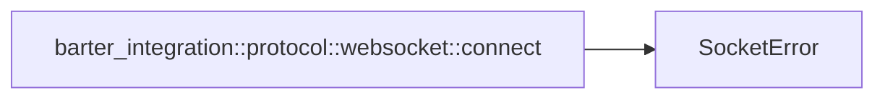

(Most actual work lives behind a `tokio_tungstenite::connect_async` call that the hypergraph treats as an external edge.)

---

### 2.2 `barter_instrument`

Module structure (depth 3):

```mermaid
flowchart TB
    bi[barter_instrument]
    bi --> Keyed
    bi --> Side
    bi --> Underlying
    bi --> asset
    bi --> exchange
    bi --> index
    bi --> instrument
    bi --> test_utils

    asset --> Asset
    asset --> AssetId
    asset --> AssetIndex
    asset --> AssetKind
    asset --> ExchangeAsset
    asset --> BaseAsset
    asset --> QuoteAsset
    asset --> asset_name[name]
    asset_name --> AssetNameInternal
    asset_name --> AssetNameExchange

    exchange --> ExchangeId
    exchange --> ExchangeIndex

    index --> IndexedInstruments
    index --> idx_builder[builder.IndexedInstrumentsBuilder]
    index --> idx_error[error.IndexError]

    instrument --> Instrument
    instrument --> InstrumentId
    instrument --> InstrumentIndex
    instrument --> instr_kind[kind]
    instrument --> instr_md[market_data]
    instrument --> instr_name[name]
    instrument --> instr_quote[quote.InstrumentQuoteAsset]
    instrument --> instr_spec[spec]
    instr_kind --> InstrumentKind
    instr_kind --> FutureContract
    instr_kind --> OptionContract
    instr_kind --> PerpetualContract
    instr_md --> MarketDataInstrument
    instr_md --> MarketDataInstrumentKind
    instr_name --> InstrumentNameInternal
    instr_name --> InstrumentNameExchange
    instr_spec --> InstrumentSpec
    instr_spec --> OrderQuantityUnits
```

Entry point: `IndexedInstruments::new` / `IndexedInstrumentsBuilder::build` — these resolve through index/builder internals only; no cross-crate egress (instability = 0).

---

### 2.3 `barter_integration`-adjacent: `barter_collector`

Module structure (depth 3):

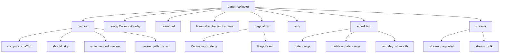

Entry point: `barter_collector::streams::stream_paginated` (depth 3):

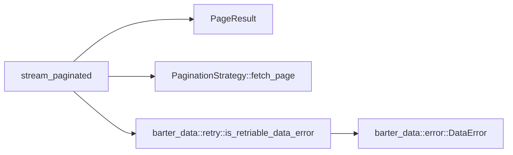

---

### 2.4 `barter_data`

Module structure (depth 2 — depth 3 explodes per-exchange):

```mermaid
flowchart TB
    bd[barter_data]
    bd --> bd_books[books]
    bd --> bd_bulk[bulk]
    bd --> bd_err[error.DataError]
    bd --> bd_event[event]
    bd --> bd_ex[exchange]
    bd --> bd_inst[instrument]
    bd --> bd_rest[rest]
    bd --> bd_retry[retry.RetryPolicy]
    bd --> bd_str[streams]
    bd --> bd_sub_er[subscriber]
    bd --> bd_sub[subscription]
    bd --> bd_trade[trade.RestTrade]
    bd --> bd_xform[transformer]

    bd_books --> OrderBook
    bd_books --> OrderBookSide
    bd_books --> Level
    bd_books --> Bids_Asks[Bids/Asks markers]
    bd_books --> bd_bk_mgr[manager.OrderBookL2Manager]
    bd_books --> bd_bk_map[map.OrderBookMap*]

    bd_ex --> binance
    bd_ex --> bitfinex
    bd_ex --> bitmex
    bd_ex --> bybit
    bd_ex --> coinbase
    bd_ex --> gateio
    bd_ex --> hyperliquid
    bd_ex --> kraken
    bd_ex --> okx
    bd_ex --> Connector_trait[Connector]
    bd_ex --> ExchangeServer_trait[ExchangeServer]
    bd_ex --> StreamSelector_trait[StreamSelector]

    bd_str --> Streams_struct[Streams]
    bd_str --> bd_str_builder[builder.StreamBuilder + MultiStreamBuilder + dynamic]
    bd_str --> bd_str_cons[consumer.MarketStreamEvent]
    bd_str --> bd_str_handle[handle.TypedHandle/DynHandle]
    bd_str --> bd_str_recon[reconnect.ReconnectingStream]

    bd_sub_er --> Subscriber_trait[Subscriber]
    bd_sub_er --> WebSocketSubscriber
    bd_sub_er --> SubscriptionMapper_trait[mapper.SubscriptionMapper]
    bd_sub_er --> SubscriptionValidator_trait[validator.SubscriptionValidator]

    bd_sub --> SubKind
    bd_sub --> Subscription
    bd_sub --> SubscriptionKind_trait[SubscriptionKind]
    bd_sub --> bd_sub_book[book.OrderBookEvent + OrderBooksL1/L2/L3]
    bd_sub --> bd_sub_candle[candle.Candle + Candles + Interval]
    bd_sub --> bd_sub_trade[trade.PublicTrade + PublicTrades]
    bd_sub --> bd_sub_liq[liquidation.Liquidation + Liquidations]

    bd_xform --> ExchangeTransformer_trait[ExchangeTransformer]
    bd_xform --> StatelessTransformer
```

Entry point: `barter_data::books::OrderBook::update` (depth 3) — the L2 hot-path called by every L2 transformer:

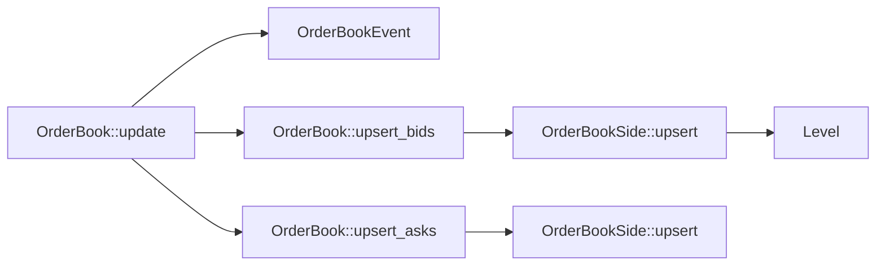

---

### 2.5 `barter_execution`

Module structure (depth 3):

```mermaid
flowchart TB
    be[barter_execution]
    be --> AccountEvent
    be --> AccountEventKind
    be --> AccountSnapshot
    be --> InstrumentAccountSnapshot
    be --> be_bal[balance]
    be --> be_cl[client]
    be --> be_err[error]
    be --> be_ex[exchange]
    be --> be_idx[indexer]
    be --> be_map[map.ExecutionInstrumentMap]
    be --> be_ord[order]
    be --> be_trade[trade]

    be_bal --> AssetBalance
    be_bal --> Balance

    be_cl --> ExecutionClient
    be_cl --> be_cl_mock[mock.MockExecution + MockExecutionConfig]

    be_err --> ClientError
    be_err --> ApiError
    be_err --> ConnectivityError
    be_err --> OrderError
    be_err --> KeyError

    be_ex --> be_ex_mock[mock.MockExchange]

    be_idx --> AccountEventIndexer
    be_idx --> IndexedAccountStream

    be_ord --> Order
    be_ord --> OrderEvent
    be_ord --> OrderKey
    be_ord --> OrderKind
    be_ord --> TimeInForce
    be_ord --> be_ord_id[id.ClientOrderId/OrderId/StrategyId]
    be_ord --> be_ord_req[request.RequestOpen/RequestCancel]
    be_ord --> be_ord_st[state.Open/Cancelled/InactiveOrderState/ActiveOrderState/OrderState]

    be_trade --> Trade
    be_trade --> TradeId
    be_trade --> AssetFees
```

Entry point: `barter_execution::indexer::AccountEventIndexer::account_event` (depth 3):

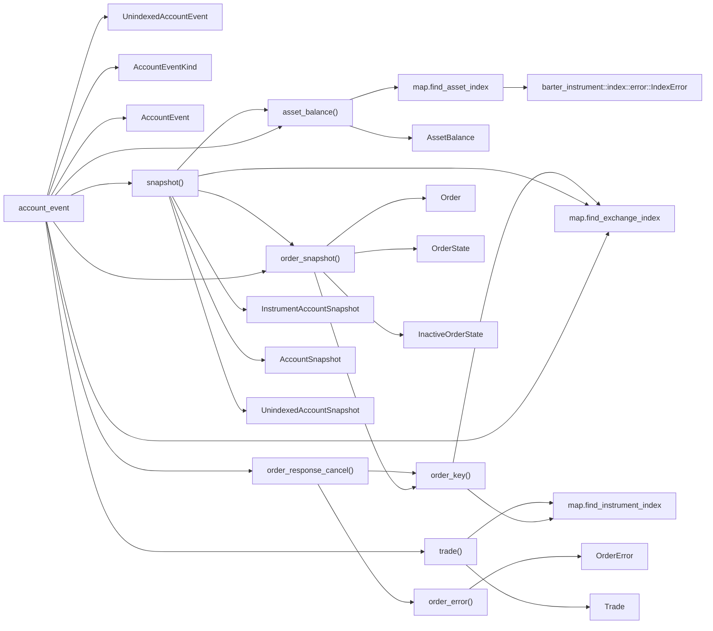

---

### 2.6 `barter`

Module structure (depth 2):

```mermaid
flowchart TB
    b[barter]
    b --> EngineEvent
    b --> Sequence
    b --> Timed
    b --> b_backtest[backtest]
    b --> b_engine[engine]
    b --> b_error[error.BarterError]
    b --> b_exec[execution]
    b --> b_log[logging.AuditSpanFilter]
    b --> b_risk[risk]
    b --> b_shutdown[shutdown]
    b --> b_stat[statistic]
    b --> b_strat[strategy]
    b --> b_sys[system]

    b_engine --> Engine
    b_engine --> EngineMeta
    b_engine --> EngineOutput
    b_engine --> Processor_trait[Processor]
    b_engine --> b_eng_action[action]
    b_engine --> b_eng_audit[audit]
    b_engine --> b_eng_clock[clock]
    b_engine --> b_eng_cmd[command.Command]
    b_engine --> b_eng_err[error.EngineError]
    b_engine --> b_eng_extx[execution_tx.ExecutionTxMap]
    b_engine --> b_eng_state[state.EngineState]

    b_strat --> AlgoStrategy
    b_strat --> ClosePositionsStrategy
    b_strat --> OnDisconnectStrategy
    b_strat --> OnTradingDisabled
    b_strat --> DefaultStrategy

    b_risk --> RiskManager
    b_risk --> RiskApproved
    b_risk --> RiskRefused
    b_risk --> DefaultRiskManager
    b_risk --> RiskCheck

    b_exec --> Execution
    b_exec --> ExecutionBuilder
    b_exec --> ExecutionManager
    b_exec --> ExecutionRequest

    b_sys --> System
    b_sys --> SystemBuilder
    b_sys --> SystemArgs
    b_sys --> SystemConfig

    b_backtest --> BacktestArgsConstant
    b_backtest --> BacktestArgsDynamic
    b_backtest --> BacktestStepper
    b_backtest --> BacktestSummary

    b_stat --> TradingSummary
    b_stat --> TradingSummaryGenerator
    b_stat --> TearSheet
    b_stat --> Drawdown
    b_stat --> SharpeRatio
    b_stat --> SortinoRatio
    b_stat --> CalmarRatio
```

Entry point 1: `barter::engine::process_with_audit` (depth 3) — the per-event dispatcher:

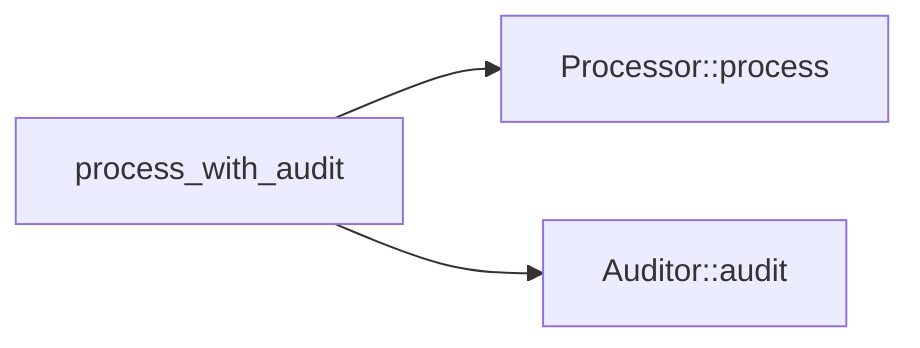

Entry point 2: `barter::backtest::backtest` (depth 3) — the wiring used by every backtest example:

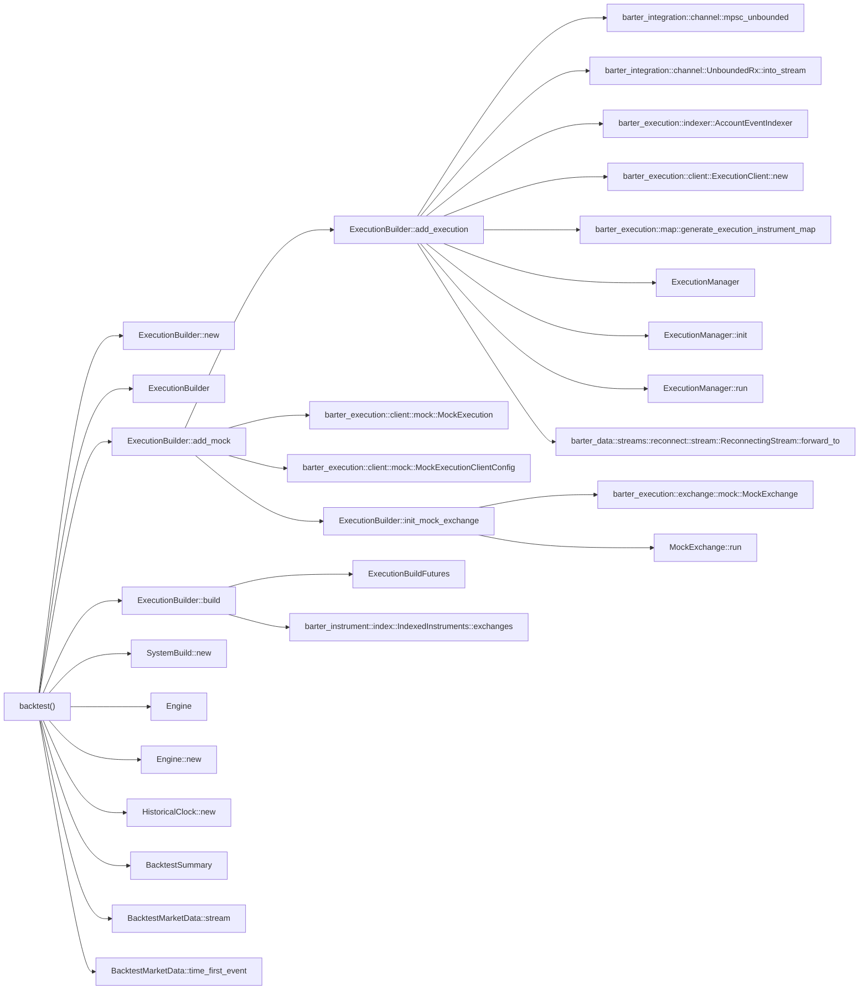

## 3. Reading guide / legend

- **Trunk edge** (`==>`, bold/orange): inter-crate edge carrying >= 30 unique producer symbols. These are where most of the API coupling lives — the seams worth gating with explicit re-exports / facade modules.
- **Leaf edge** (`-->`, thin/blue): smaller dependency, typically a couple of types or helper functions.
- **Instability column** (table above): closer to 0 means the crate is depended-on more than it depends; closer to 1 means it's a pure leaf. `barter_instrument` (0.00) and `barter_integration` (0.06) are foundations; `barter` (0.31) and `barter_execution` (0.25) sit in the middle; `barter_collector` (1.00) is purely top-level.
- **Module trees**: the nodes mirror the on-disk `crates/<name>/src/...` layout. Sub-modules elided where they contain only test helpers or per-exchange/per-endpoint sub-trees (notably `barter_data::exchange::*` at depth 3 — see the per-exchange skeleton files under `.skeleton/barter-data/`).
- **Call graphs**: directed edges go from caller to callee. `Trait::method` nodes represent local-trait dispatch (the hypergraph cannot pin them to a specific impl). Cross-crate hops are visible because both ends carry their crate-qualified name.
- **What's missing**: `dyn Trait` calls over external traits, generic `F: Fn(..)` calls, and external-crate impl-method nodes are not captured by the hypergraph. The most notable example is `barter_integration::protocol::websocket::connect` whose body delegates to `tokio_tungstenite::connect_async`, an external symbol invisible to this analysis.
